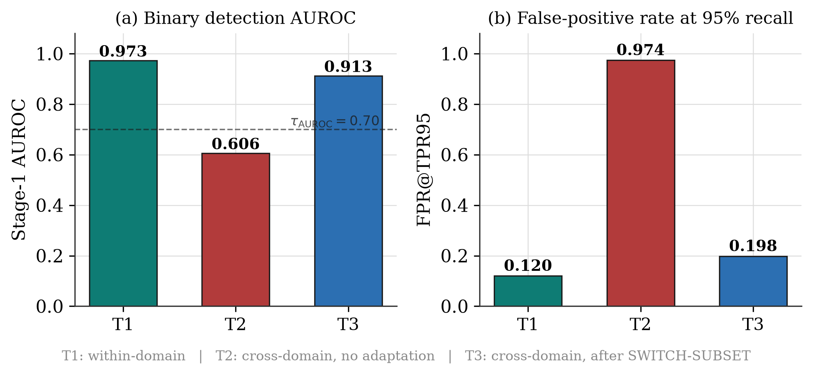
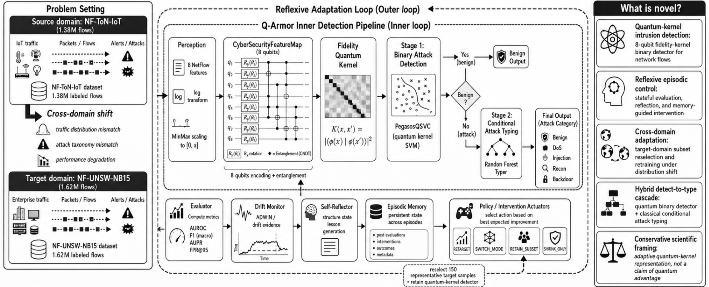

# Q-Armor

**A Reflexive Quantum-Kernel Intrusion Detection Approach**

[Paper](docs/paper.tex) · [Datasets: NF-ToN-IoT / NF-UNSW-NB15](https://staff.itee.uq.edu.au/marius/NIDS_datasets/) · License: MIT

<p align="center">
  
</p>

## Overview

Q-Armor couples an 8-qubit fidelity quantum kernel with a deterministic, stateful episodic controller to detect and adapt to network intrusions across heterogeneous NetFlow domains, without retraining on the full target dataset. On a sealed held-out split it reaches **0.973 AUROC** within-domain and recovers cross-domain AUROC from **0.606 to 0.913** after adapting on 150 target-domain samples.

An equal-budget confirmatory study (10 seeds, matched target-label budgets $B\in\{0,25,50,100,150,300\}$) shows this recovery is **not** evidence of quantum advantage — classical baselines (Random Forest, GBT) match or exceed it at the same budget, with lower variance. That finding, alongside a poisoning study, a natural-class-prevalence evaluation, and a live IBM Quantum run, is reported in full in the paper.

<p align="center">
  
</p>

## Architecture

A **data plane** (`perception/`, `reasoning/`, `action/`) runs an 8-qubit `CyberSecurityFeatureMap` → `FidelityQuantumKernel` → `PegasosQSVC` detector feeding a classical Detect→Type cascade. A **control plane** (`agent/`, `planning/`, `memory/`) evaluates performance every 100-flow episode and selects one of four deterministic interventions — `REINFORCE`, `SWITCH_MODEL`, `SWITCH_SUBSET`, `BINARY_ONLY` — never a learned policy.

## Reproduce

```bash
git clone https://github.com/madhavseth512/Q-Armor.git && cd Q-Armor
python -m venv venv && venv\Scripts\activate   # source venv/bin/activate on macOS/Linux
pip install -r requirements.txt

pytest tests/ -v                                    # full test suite
python -m experiments.phase8_final_eval --confirm   # reproduce the sealed results
python docs/generate_figures.py                     # regenerate every figure from current results
```

Datasets are not bundled (multi-GB, git-ignored) — download NF-ToN-IoT and NF-UNSW-NB15 and place them under `data/`.

## Authors

**Shiva Raj Pokhrel** (Deakin University, Chief Investigator) and **Madhav Seth** (IIT Kharagpur, Research Intern).

```bibtex
@unpublished{seth2026qarmor,
  title  = {A Reflexive Quantum-Kernel Intrusion Detection Approach},
  author = {Seth, Madhav and Pokhrel, Shiva Raj},
  year   = {2026},
  note   = {Manuscript}
}
```

Academic research prototype — not intended for production deployment.
